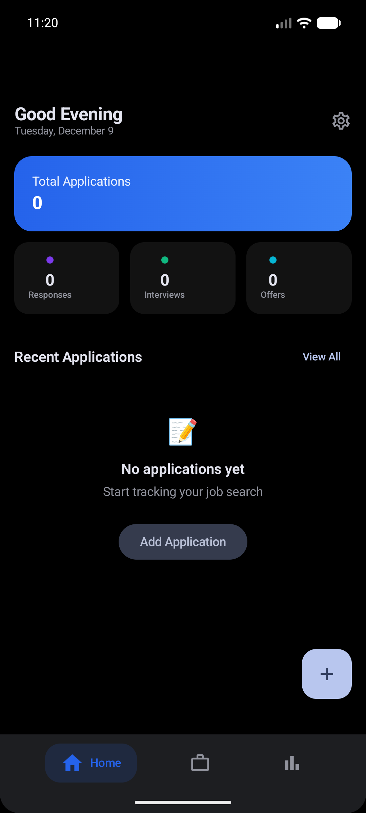
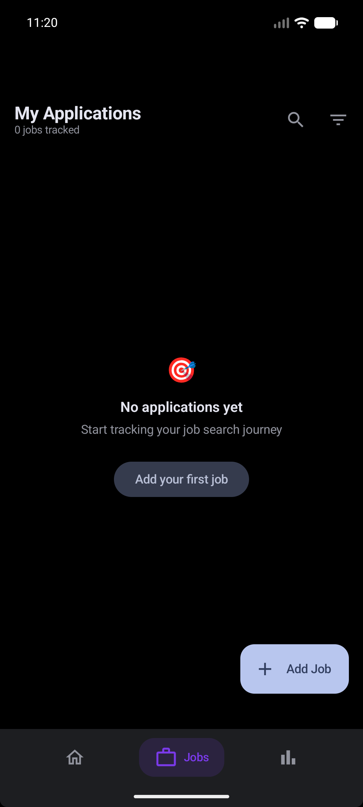
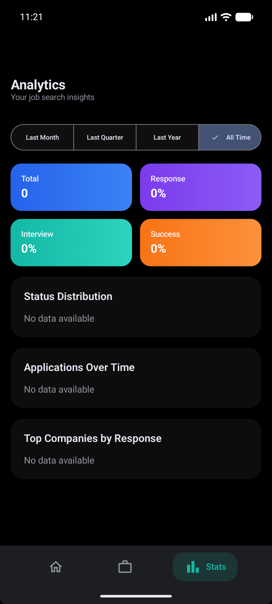

# JobTrackr 📋

A modern Android app to track your job applications, built with Jetpack Compose and Material Design 3.

## Features

🎯 **Application Tracking**
- Track job applications with company, title, location, and salary info
- Multiple status stages: Applied → Email → Phone → Interview → Offer
- Mark applications as Rejected or Ghosted

📊 **Dashboard & Analytics**
- Visual statistics and charts (MPAndroidChart)
- Filter and sort applications
- Track your job search progress

💾 **Data Management**
- Local Room database storage
- Backup to Google Drive, Google Sheets, Notion, or CSV
- Status history tracking

🎨 **Modern UI**
- Material Design 3 with dynamic theming
- Light/Dark/System theme modes
- Smooth 120fps scrolling with Compose optimizations

## Tech Stack

| Category | Technology |
|----------|------------|
| Language | Kotlin |
| UI | Jetpack Compose |
| Architecture | MVVM + Clean Architecture |
| DI | Hilt |
| Database | Room |
| Async | Coroutines + Flow |
| Charts | MPAndroidChart |
| Navigation | Navigation Compose |

## Requirements

- Android 8.0 (API 26) or higher
- Android Studio Hedgehog or newer

## Installation

1. Clone the repository:
```bash
git clone https://github.com/s3nafps/JobTrackr.git
```

2. Open in Android Studio

3. Build and run on your device/emulator

## Screenshots

<p align="center">
  
  
  
</p>

## Project Structure

```
app/src/main/java/ms/dev/jobtrackerpro/
├── data/
│   ├── backup/          # Backup serialization
│   ├── local/           # Room database, DAOs, entities
│   ├── mapper/          # Entity mappers
│   └── repository/      # Repository implementations
├── di/                  # Hilt modules
├── domain/
│   ├── model/           # Domain models
│   ├── repository/      # Repository interfaces
│   └── usecase/         # Use cases
├── presentation/
│   ├── analytics/       # Analytics screen
│   ├── applications/    # Applications list
│   ├── components/      # Reusable UI components
│   ├── dashboard/       # Dashboard screen
│   ├── detail/          # Application detail
│   ├── navigation/      # Navigation graph
│   └── settings/        # Settings screen
└── ui/theme/            # Material 3 theming
```

## Building

```bash
# Debug build
./gradlew assembleDebug

# Release build
./gradlew assembleRelease

# Run tests
./gradlew test
```

## License

```
MIT License

Copyright (c) 2024 Mohamed Senator

Permission is hereby granted, free of charge, to any person obtaining a copy
of this software and associated documentation files (the "Software"), to deal
in the Software without restriction, including without limitation the rights
to use, copy, modify, merge, publish, distribute, sublicense, and/or sell
copies of the Software, and to permit persons to whom the Software is
furnished to do so, subject to the following conditions:

The above copyright notice and this permission notice shall be included in all
copies or substantial portions of the Software.

THE SOFTWARE IS PROVIDED "AS IS", WITHOUT WARRANTY OF ANY KIND, EXPRESS OR
IMPLIED, INCLUDING BUT NOT LIMITED TO THE WARRANTIES OF MERCHANTABILITY,
FITNESS FOR A PARTICULAR PURPOSE AND NONINFRINGEMENT. IN NO EVENT SHALL THE
AUTHORS OR COPYRIGHT HOLDERS BE LIABLE FOR ANY CLAIM, DAMAGES OR OTHER
LIABILITY, WHETHER IN AN ACTION OF CONTRACT, TORT OR OTHERWISE, ARISING FROM,
OUT OF OR IN CONNECTION WITH THE SOFTWARE OR THE USE OR OTHER DEALINGS IN THE
SOFTWARE.
```

## Author

**Mohamed Senator**

---

⭐ Star this repo if you find it useful!
